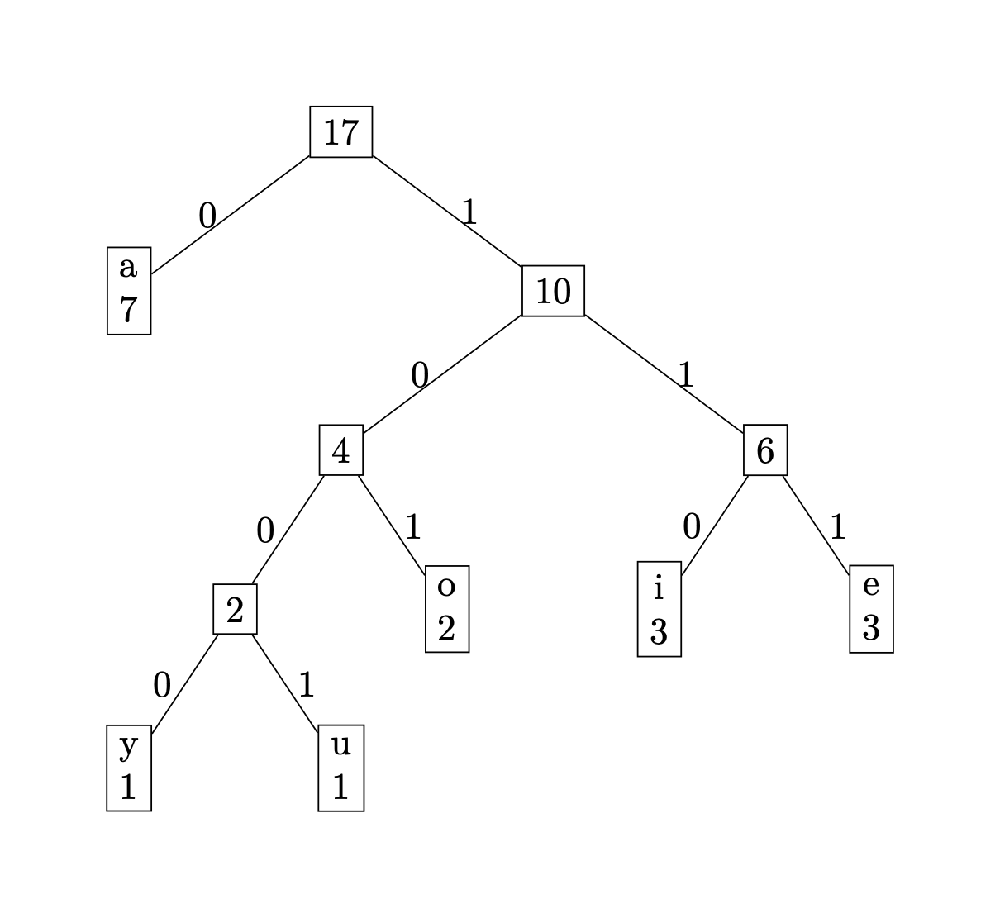

# Calculate Huffman Coding Length

In this problem, you are required to solve a problem related to huffman coding.

Recall: Huffman coding is a lossless data compression algorithm that assigns variable-length codes to characters based on their frequency of occurrence in the input. An efficient algorithm for
generating it is related to the priority queue and covered in course slides.

The files attached to this problem are shown as follows. We provide a test to help you check your code.

```
.
└── attachments/
    ├── tests/
    │   └── test_huffman.cpp
    └── huffman_calculator.hpp
```

**NOTE**:

1. You should **NEVER** use `std::priority_queue`, `std::map`, `std::set`, `std::multimap`, `std::multiset` or call heap related functions like `std::make_heap()`.
2. In the question, you should write a more optimal algorithm that brute-force Huffman tree building to pass all tests.

## Requirements:

Your task is to complete the function `size_t get_huffman_length(const std::vector<std::pair<size_t, size_t>> &data)` in `huffman_calculator.hpp`.

### Description

Assume that we have a sequence:

```text
i a u e i y a a e a o o a a i e a
```

Count the occurrence of each character:

| character | occurrence |
| --------- | ---------- |
| a         | 7          |
| e         | 3          |
| i         | 3          |
| o         | 2          |
| u         | 1          |
| y         | 1          |

Then we generate the huffman tree (a possible solution):



Hence, we can shorten the sequence into the following format (ignore the space of storing the huffman tree):

```text
110010011111101000001110101101001101110
```

**With Huffman Coding, the sequence can be shortened to length 39 (binary).**

### Parameter `data`

In this question, we help you to ignore the process of dealing the bunch of `text`.
Instead, we directly give you some pairs.

The first number (of type `size_t`, named **occurrence**) indicate a possible number of occurrence of the character.
**Occurrence** will always be a positive number.

The second number (of type `size_t`, named **amount**) indicate the number of characters satisfies the number of occurrences given by the first number.
**Amount** will always be a positive number.

In the example above, we have characters with occurrences `(7, 3, 3, 2, 1, 1)`.

So the `data` we pass to you in this example will be: `[(7, 1), (3, 2), (2, 1), (1, 2)]`

### Return value

You need to return the length of the Huffman encoded sequence.

In this example, the return value is `39`.

### Misc.

For your convenience, all the pairs we provide are guaranteed to have different **occurrences**.

We also guarantee that the sum of **amount** is larger than 1.

When iterating through the `std::map`, the order is **NOT** guaranteed to be sorted by any means.

### Data constraints

We use $m$ to denote the number of pairs, $K_i$ to denote the amount in the i-th pair.

In all test cases, it is guaranteed that $1\le m \le 4000, 1\le K_i \le 150000$. 

### Time complexity

If your algorithm takes $\Theta(n\log n)$ time, where $n=\sum K_i$, you will receive about 40 pts.

If your algorithm takes $\Theta(m\log m \log K_i)$ time, you will receive 100 pts.

### Hint

The pair `(10, 10)` is somehow "equivalent" to `(20, 5)`.

You can calculate the return value in the process of building the huffman tree.

## 提交与评分

在 OJ 上提交 `huffman_calculator.hpp` 内的全部内容。

本题的评分由 OJ 分数（60%）和线下 check （40%）两部分构成。线下 check 会在此次作业结束时间之后进行。

注：线下 check 也带有检查学术诚信的含义，当然这不是唯一的手段。如果被认定为抄袭， OJ 的分数也会作废，并且会有惩罚。**特别强调，抄袭来自 generative AI 的代码和抄袭网上的代码是同等处理的，我们建议您在写作业时关闭一切
generative AI 工具。**
